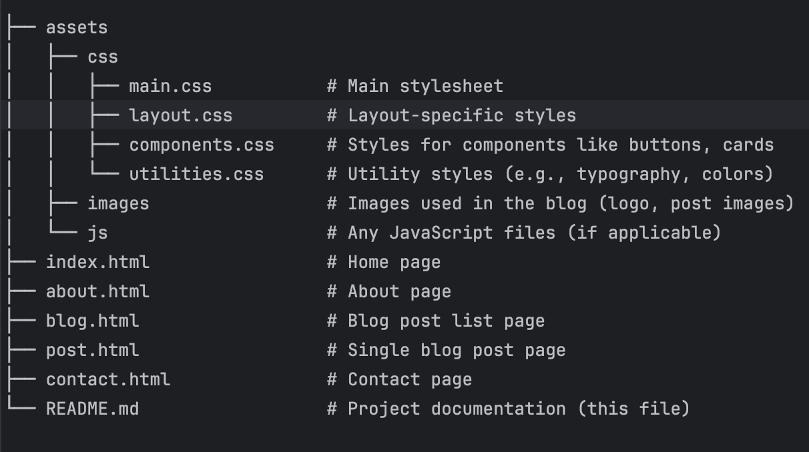

# My Personal Tech Blog

This is a simple personal blog website where I share insights and articles about technology, development, and personal growth. The blog is built with HTML and CSS and is designed to be responsive across all devices.

## Features

- **Responsive Design**: The website is optimized to work across various screen sizes, including desktop, tablet, and mobile.
- **Blog Section**: Displays a list of blog posts with individual post pages.
- **About Page**: Contains information about the blog author.
- **Contact Page**: A contact form to allow visitors to get in touch.
- **Related Articles Section**: Shows related blog posts for further reading.
- **CSS Flexbox and Media Queries**: Used extensively for layout and responsiveness.

## Pages

- **Home (index.html)**: A landing page featuring a brief introduction and recent blog posts.
- **About (about.html)**: Information about the blog author.
- **Blog (blog.html)**: A list of all blog posts.
- **Post (post.html)**: A single blog post page with related articles.
- **Contact (contact.html)**: A page with a form where users can reach out to the author.

## Directory Structure



## Getting Started

### Prerequisites

- Basic knowledge of HTML and CSS.
- A modern web browser to view the website.

### How to Use

1. **Clone or Download the Project**:
    ```bash
    git clone https://github.com/Abdurahman-hassan/myBlog.git
    ```
   Or download the project as a ZIP file and extract it to your local environment.

2. **Open in Browser**:
    - Open the `index.html` file in a web browser to view the homepage.
    - Navigate to the different pages using the links in the navigation bar.

3. **Customize the Content**:
    - Modify the text in the HTML files to reflect your own personal content.
    - Change the images located in the `assets/images` folder to personalize the look of the website.

### Mobile Responsiveness

This blog design is fully responsive. It uses media queries and flexbox to adapt to different screen sizes. You can test it by resizing your browser window or using the developer tools in your browser.

## CSS Structure

The CSS is divided into three primary files for better organization:

1. **`layout.css`**: Manages the layout structure of the website, including the header, footer, and page grids.
2. **`components.css`**: Contains styles for individual components like buttons, cards, and form elements.
3. **`utilities.css`**: Contains utility classes for typography, colors, and other reusable design elements.

### Main Sections of the Website:

- **Header**: Includes a logo and navigation bar.
- **Main Content**: Displays the main content of each page (introduction, blog posts, about, contact).
- **Footer**: A simple footer with copyright information.

## License

This project is licensed under the MIT License

